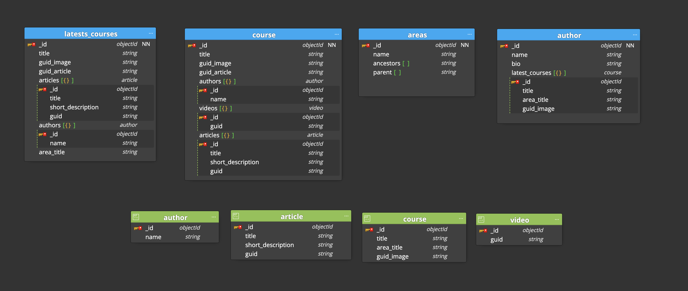

# Lemoncode-Backend-Modulo1

Lemoncode - Bootcamp Backend - Módulo 1

## **Descripción**

En este módulo he creado un modelado para el ejercicio propuesto.

## **Modelo**

El modelo resultante es

## **Patrones Aplicados**

Para la optimización del modelo he aplicado los siguientes patrones:

 - **Subset Pattern** 
	 Para que la carga de los elementos sea más rápida y para evitar joins en elementos que se van a cargar en multitud de ocasiones y se van a modificar poco, creo que es la mejor opción, ya que de esta manera, aunque se dupliquen datos, la velocidad de acceso a los mismos se mejora considerablemente.
	 
- **Tree Pattern** 
	He usado este patrón para la colección de areas de los cursos, ya que no son datos que se actualicen demasiado, pero sí son de alta lectura, por lo que de esta forma tendremos mucho más control a la hora de obtener areas padre e hijos sin un coste tan alto de recursos, aunque se dupliquen datos. 